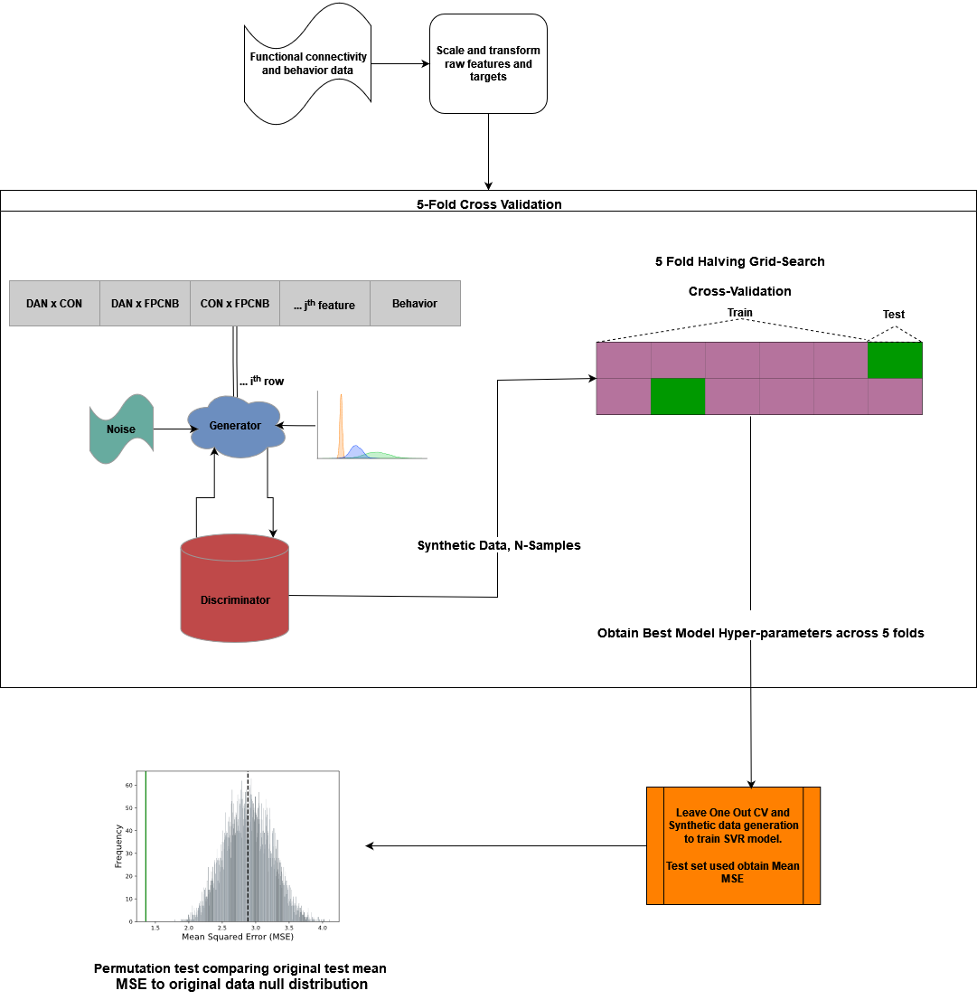

# Individual-level Functional Connectivity Predicts Cognitive Control Efficiency

Repository of code used to run our SVR model in the paper by Deck 2023: Individual-level Functional Connectivity Predicts Cognitive Control Efficiency


## Synthetic Data Generation Support Vector Regression




### Project description

This folder contains the scripts and functions necessary to run an SVR model with synthetic data. 

Within the ```utils``` directory you will find the file entitled ```pipeline_funcs.py```. This Python module contains all of the functions necessary to run the synthetic data SVR. 

You will also find two other files within this directory which are necessary to run this pipeline. The first is the ```synth_svr.py```. This Python script creates the pipeline and calls the functions within ```pipeline_funcs```. Finally, there is a file aptly named ```wrapper_synth_svr.py```. This file serves as  wrapper script which will call the SVR function and run the SVR model on input data. 

The diagram above indicates the processing steps which are as follows:
1. Transform and scale original features and target data
2. Split the original data into train and test sets using a [K-Fold CV method](https://scikit-learn.org/stable/modules/generated/sklearn.model_selection.KFold.html#sklearn.model_selection.KFold) with 5 folds.
3. Use the original ShuffleSplit training sample to train a Conditional Tabular Generative Adversarial Network ([CTGANS](https://sdv.dev/SDV/user_guides/single_table/ctgan.html)) model.
4. Generate N-samples (set by user)
5. Perform model selection using a [Halving GridSearch CV](https://scikit-learn.org/stable/modules/generated/sklearn.model_selection.HalvingGridSearchCV.html) method with 5 folds. This is a much faster implementation of the traditional GridSearchCV
6. The best hyperparameter model this then selected based on the greatest R-squared
7. A leave one out CV [scheme](https://scikit-learn.org/stable/modules/generated/sklearn.model_selection.LeaveOneOut.html) is used where upon each fold the SVR model is trained on newly created synthetic data from all but the single test subject (the original hold-out test set).
8. The overall test MSE is from the single test subject in step 7 and the median test MSE is computed
9. Finally, a permutation test is computed where the original MSE is the median MSE from step 8. The null distribution is created using all of the original data and permuting the target variable N number of times (permutation number is set by user)


Please check the ```requirements.txt``` file for most up to date package requirements.
